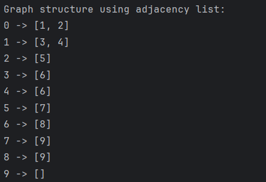
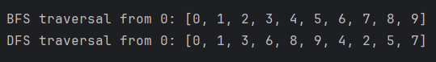
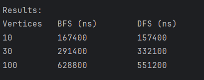

# Assignment 4 – Graph Traversal and Representation System
(`Bonus Tasks Explanation at the end`)

## A. Project Overview

This project is a simple Java program for graph representation and graph traversal.

The graph is represented using an adjacency list. In an adjacency list, each vertex stores a list of its connected neighbor vertices. This representation is simple and memory efficient because it stores only existing edges.

A vertex is a node in the graph. In this project, each vertex has a unique integer ID.

An edge is a connection between two vertices. In this project, edges are added from one vertex to another vertex.

The project implements two graph traversal algorithms:

- BFS – Breadth-First Search
- DFS – Depth-First Search

BFS visits vertices level by level. DFS goes deeper into the graph before going back.

The program also tests BFS and DFS on graphs with different sizes:

- Small graph: 10 vertices
- Medium graph: 30 vertices
- Large graph: 100 vertices

Execution time is measured using `System.nanoTime()`.

---

## B. Class Descriptions

### Vertex

The `Vertex` class represents one node in the graph.

Private field:

- `id` — unique identifier of the vertex

Methods:

- Constructor
- `getId()`
- `toString()`

Example:

```java
Vertex v = new Vertex(0);
```

---

### Edge

The `Edge` class represents a connection between two vertices.

Private fields:

- `source` — starting vertex
- `destination` — ending vertex

Methods:

- Constructor
- `getSource()`
- `getDestination()`
- `toString()`

Example:

```java
Edge e = new Edge(source, destination);
```

---

### Graph

The `Graph` class represents the graph structure.

The graph is stored using an adjacency list. The adjacency list stores each vertex ID and the list of vertices connected to it.

Example:

```text
0 -> [1, 2]
1 -> [3, 4]
2 -> [5]
```

Main methods:

- `addVertex(Vertex v)` — adds a new vertex to the graph
- `addEdge(int from, int to)` — adds an edge between vertices
- `printGraph()` — prints the adjacency list
- `bfs(int start)` — runs Breadth-First Search
- `dfs(int start)` — runs Depth-First Search

The adjacency list gives simple access to neighbors of each vertex.

---

### Experiment

The `Experiment` class handles testing and analysis.

Main methods:

- `runTraversals(Graph g)` — runs BFS and DFS on a graph
- `runMultipleTests()` — creates graphs with 10, 30, and 100 vertices
- `printResults()` — prints execution time results

This class measures the execution time of BFS and DFS using:

```java
long start = System.nanoTime();
long end = System.nanoTime();
```

---

## C. Algorithm Descriptions

## BFS – Breadth-First Search

BFS means Breadth-First Search.

BFS starts from one vertex and visits all close vertices first. After that, it moves to the next level of vertices.

BFS uses a queue.

### BFS Steps

1. Choose the starting vertex.
2. Mark the starting vertex as visited.
3. Add the starting vertex to the queue.
4. Take one vertex from the queue.
5. Visit all unvisited neighbors of this vertex.
6. Add these neighbors to the queue.
7. Repeat until the queue is empty.

### BFS Use Cases

BFS is useful when:

- We need the shortest path in an unweighted graph
- We need to search level by level
- We need to check reachable vertices from a starting point

### BFS Time Complexity

```text
O(V + E)
```

Where:

- `V` is the number of vertices
- `E` is the number of edges

BFS visits each vertex and each edge at most once.

---

## DFS – Depth-First Search

DFS means Depth-First Search.

DFS starts from one vertex and goes as deep as possible before returning back.

DFS can be implemented using recursion or a stack.

### DFS Steps

1. Choose the starting vertex.
2. Mark the vertex as visited.
3. Visit one unvisited neighbor.
4. Continue going deeper.
5. If there are no unvisited neighbors, go back.
6. Repeat until all reachable vertices are visited.

### DFS Use Cases

DFS is useful when:

- We need to explore all paths
- We need to check connected components
- We need to detect cycles
- We need to solve maze-like problems

### DFS Time Complexity

```text
O(V + E)
```

Where:

- `V` is the number of vertices
- `E` is the number of edges

DFS also visits each vertex and each edge at most once.

---

## D. Experimental Results

The program was tested on three graph sizes:

- 10 vertices
- 30 vertices
- 100 vertices

Execution time was measured in nanoseconds.

### Execution Time Comparison

| Vertices | BFS Time (ns) | DFS Time (ns) |
|---:|---:|---:|
| 10 | 100300   | 113000 |
| 30 | 161900 | 239600 |
| 100 | 355800 | 414300 |

> Note: The exact time can be different on another computer because it depends on hardware and current system load.

---

### Observations and Patterns

When the graph size increases, the number of vertices and edges also increases. Because of this, BFS and DFS usually need more time to complete.

BFS and DFS have similar time complexity because both algorithms visit vertices and edges. The difference in time can happen because BFS uses a queue, while DFS uses a stack or recursion.

In my experiment, DFS was faster for some graph sizes, but the result can change depending on the graph structure and the order of edges in the adjacency list.

---

### Analysis Questions

### 1. How does graph size affect BFS and DFS performance?

When graph size becomes larger, BFS and DFS usually take more time. This happens because the algorithms need to visit more vertices and more edges.

For example, a graph with 100 vertices has more work than a graph with 10 vertices.

---

### 2. Which traversal is faster in your experiments?

In my experiment, DFS was faster for some graph sizes, while BFS was close in performance.

The difference was not very large because both algorithms have the same time complexity:

```text
O(V + E)
```

The result can change depending on graph structure and computer performance.

---

### 3. Do results match the expected complexity O(V + E)?

Yes, the results match the expected complexity.

Both BFS and DFS visit each vertex and each edge at most once. This means their running time depends on the number of vertices and edges.

So, the expected complexity is:

```text
O(V + E)
```

---

### 4. How does graph structure affect traversal order?

Graph structure affects the order in which vertices are visited.

BFS visits vertices level by level. It first visits vertices that are close to the starting vertex.

DFS goes deeper first. It may visit vertices far from the start before visiting other nearby vertices.

The order of neighbors in the adjacency list also affects the final traversal order.

---

### 5. When is BFS preferred over DFS?

BFS is preferred when we need the shortest path in an unweighted graph.

BFS is also useful when we want to explore the graph level by level.

Example use cases:

- Shortest path in an unweighted graph
- Finding the closest connection
- Checking reachability by levels

---

### 6. What are the limitations of DFS?

DFS does not always find the shortest path.

DFS can go very deep before checking other paths. Because of this, it may not be the best choice when we need the shortest path.

If DFS is implemented recursively, it can also cause stack overflow on very large or deep graphs.

---

## E. Screenshots


### Graph Structure Output



This screenshot shows the adjacency list representation of the small graph.

---

### BFS/DFS Traversal Output



This screenshot shows BFS/DFS traversal starting from vertex `0`.

---

### Performance Results



This screenshot shows the execution time comparison for graphs with 10, 30, and 100 vertices.

---

## F. Reflection

During this assignment, I learned how graphs can be represented using an adjacency list. I also learned how vertices and edges are connected in a graph structure. The adjacency list was simple to use because each vertex stores only its connected neighbors.

I also learned the difference between BFS and DFS. BFS uses a queue and visits vertices level by level. DFS goes deeper first before returning back. The main challenge was to make sure that the same vertex is not visited more than once. To solve this, I used a visited set.

This assignment helped me understand that BFS and DFS both have time complexity O(V + E), because they visit vertices and edges of the graph.

---


---


## Example Output

```text
Small Graph:
0 -> [1, 2]
1 -> [3, 4]
2 -> [5]
3 -> [6]
4 -> [6]
5 -> [7]
6 -> [8]
7 -> [9]
8 -> [9]
9 -> []

BFS: 0 1 2 3 4 5 6 7 8 9
DFS: 0 1 3 6 8 9 4 2 5 7

Size: 10
BFS: ...
DFS: ...

Size: 30
BFS: ...
DFS: ...

Size: 100
BFS: ...
DFS: ...

Results:
Vertices   BFS (ns)        DFS (ns)
10         315800          289900
30         914400          824900
100        104200          152000
```

---

## Bonus Task: Dijkstra's Algorithm

For the bonus task, I implemented Dijkstra's Algorithm to find the shortest path from a starting vertex to all other vertices in a weighted graph.

### Requirements Completed

The graph was extended to support weighted edges.

The `Edge` class was modified and now includes a `weight` field.

The graph structure was updated to store weighted edges using an adjacency list.

The following method was implemented:

```java
void dijkstra(int start)
```

### What Was Added

The project now supports weighted edges using this method:

```java
addEdge(int from, int to, int weight)
```

Example:

```java
addEdge(0, 1, 4);
```

This means there is an edge from vertex `0` to vertex `1` with weight `4`.

### How Dijkstra's Algorithm Works

Dijkstra's Algorithm starts from one selected vertex and calculates the shortest distance from that vertex to all other vertices in the graph.

The implementation uses an array for distances, an array for visited vertices, an array for previous vertices, and simple loops to find the closest unvisited vertex.

A priority queue was not used because the bonus task allows a simple implementation with arrays and loops.

### Important Rule

Negative edge weights are not allowed.

Dijkstra's Algorithm does not work correctly with negative edge weights, so the program checks that edge weights are not negative.

### Example Usage

```java
smallGraph.dijkstra(0);
```

This runs Dijkstra's Algorithm starting from vertex `0`.

### Example Output

```text
Dijkstra shortest paths from vertex 0:
Vertex     Distance        Path
0          0               0
1          4               0 -> 1
2          2               0 -> 2
3          9               0 -> 1 -> 3
4          14              0 -> 1 -> 4
5          5               0 -> 2 -> 5
6          11              0 -> 1 -> 3 -> 6
7          13              0 -> 2 -> 5 -> 7
8          15              0 -> 1 -> 3 -> 6 -> 8
9          16              0 -> 1 -> 3 -> 6 -> 8 -> 9
```

### Complexity

This implementation uses simple loops.

Time complexity:

```text
O(V^2 + E)
```

Where `V` is the number of vertices and `E` is the number of edges.

### Summary

The bonus task was completed by adding weighted edges and implementing Dijkstra's Algorithm to calculate the shortest paths from a starting vertex to all other vertices in the graph.
